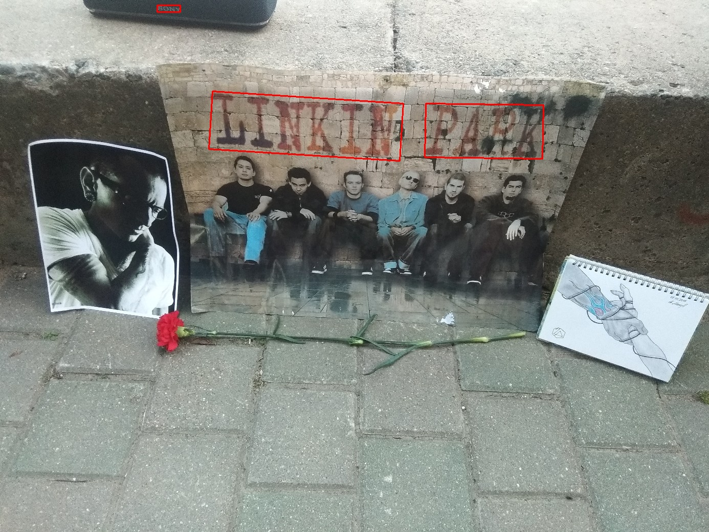

## CRAFT: Character-Region Awareness For Text detection
[Paper](https://arxiv.org/abs/1904.01941) | [Pretrained Model](https://drive.google.com/open?id=1Jk4eGD7crsqCCg9C9VjCLkMN3ze8kutZ) | [Supplementary](https://youtu.be/HI8MzpY8KMI)

**[Youngmin Baek](mailto:youngmin.baek@navercorp.com), Bado Lee, Dongyoon Han, Sangdoo Yun, Hwalsuk Lee.**
 
Clova AI Research, NAVER Corp.

### Simple inference example

```python

from inference_utils import load_image, load_detector, test_net, visualize_detection

checkpoint_path = 'weights/craft_mlt_25k.pth'
device = 'cuda'

net = load_detector(checkpoint_path, device)
 
image_size = 1280  # image size for inference
mag_ratio = 1.5  # image magnification ratio

poly = False  # enable polygon type
text_threshold = 0.7  # text confidence threshold
low_text = 0.4  # text low-bound score
link_threshold = 0.4  # link confidence threshold


image = load_image('/home/vladislav.leketush/Documents/chester_minsk_20.07.2019.jpg')

bboxes, polys, score_text = test_net(net, image, image_size, mag_ratio, text_threshold, link_threshold, low_text, device, poly)

visualize_detection(image, bboxes)

```



### Overview
PyTorch implementation for CRAFT text detector that effectively detect text area by exploring each character region and affinity between characters. The bounding box of texts are obtained by simply finding minimum bounding rectangles on binary map after thresholding character region and affinity scores. 


## Citation
```
@article{baek2019character,
  title={Character Region Awareness for Text Detection},
  author={Baek, Youngmin and Lee, Bado and Han, Dongyoon and Yun, Sangdoo and Lee, Hwalsuk},
  journal={arXiv preprint arXiv:1904.01941},
  year={2019}
}
```

## License
```
Copyright (c) 2019-present NAVER Corp.

Permission is hereby granted, free of charge, to any person obtaining a copy
of this software and associated documentation files (the "Software"), to deal
in the Software without restriction, including without limitation the rights
to use, copy, modify, merge, publish, distribute, sublicense, and/or sell
copies of the Software, and to permit persons to whom the Software is
furnished to do so, subject to the following conditions:

The above copyright notice and this permission notice shall be included in
all copies or substantial portions of the Software.

THE SOFTWARE IS PROVIDED "AS IS", WITHOUT WARRANTY OF ANY KIND, EXPRESS OR
IMPLIED, INCLUDING BUT NOT LIMITED TO THE WARRANTIES OF MERCHANTABILITY,
FITNESS FOR A PARTICULAR PURPOSE AND NONINFRINGEMENT.  IN NO EVENT SHALL THE
AUTHORS OR COPYRIGHT HOLDERS BE LIABLE FOR ANY CLAIM, DAMAGES OR OTHER
LIABILITY, WHETHER IN AN ACTION OF CONTRACT, TORT OR OTHERWISE, ARISING FROM,
OUT OF OR IN CONNECTION WITH THE SOFTWARE OR THE USE OR OTHER DEALINGS IN
THE SOFTWARE.
```
